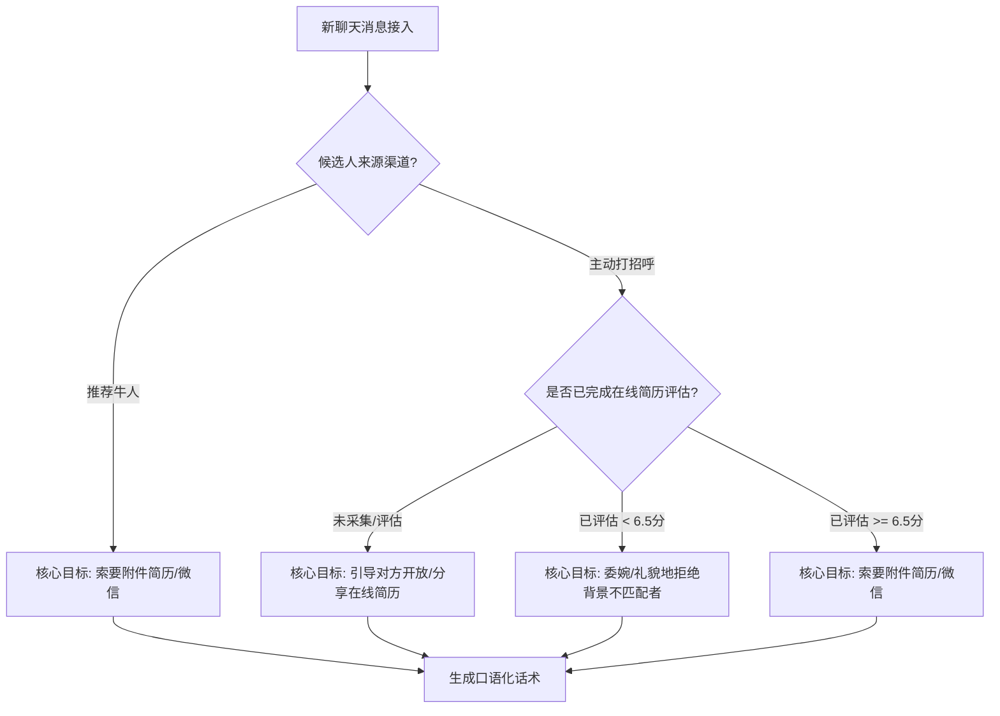

# 🤖 Boss直聘猎头 Copilot

**智能猎头招聘助手** — 这是一个专为猎头顾问打造的智能辅助工具。它能够自动运行在你的 Boss直聘浏览器环境中，实现**智能推荐牛人打招呼、在线简历自动采集评估、聊天会话渠道分流，以及基于大模型的智能个性化自动回复**，并配合微信通知，帮你极大提升简历收集效率。

---

## 🌟 核心功能一览

1. **智能推荐评估与一键打招呼**：
   * 在“推荐牛人”列表页自动扫描候选人画像，通过大模型进行岗位匹配打分（1-10分）并生成匹配原因。
   * 自动过滤低分候选人，仅对高评分（默认 >= 6.5分）的优质候选人主动打招呼，避免浪费每日打招呼额度。
2. **候选人渠道分流与真名关联**：
   * 智能关联候选人推荐记录与聊天记录。对于以“先生/女士”称呼的推荐候选人，在其进入聊天后，系统会自动根据其姓名、最近公司、职位等多维度特征关联，并将其在数据库中的名字自动更新为真实姓名。
3. **不同来源差异化聊天策略**：
   * **推荐牛人来源**：已经过前置大模型评分，进入聊天后，AI 会**直接引导其发送附件简历或交换微信**，绝不重复索要在线简历。
   * **主动打招呼来源**：
     * 自动打开并采集其“在线简历”，上报给大模型在后台进行背景打分。
     * **若简历尚未公开/正在评估**：AI 话术会温柔引导候选人“开放/分享在线简历”。
     * **评估达标 (>= 6.5分)**：AI 自动索要附件简历或微信。
     * **评估不达标 (< 6.5分)**：AI 会生成一段充满人情味的委婉拒绝信，并祝其求职顺利。
4. **防封号真人行为模拟**：
   * 模拟鼠标悬停、随机间隔的高斯分布延迟、真人打字速度逐字输入。
   * 智能工作时间窗口限制、令牌桶限流，以及每连续工作 2 小时自动进入“喝茶休息”状态，防止触发 Boss 平台反爬虫与封号机制。
5. **通知与管理后台**：
   * **微信机器人通知**：当候选人发送附件简历或提到关键联系信息时，或者需要人工介入（大模型无法应对的敏感/复杂问题）时，微信机器人会实时推送通知。
   * **猎头工作台 (Dashboard)**：访问网页后台，进行岗位 JD 设置、查看每日漏斗数据、审核推荐列表、搜索历史聊天记录（带消息气泡的左右分屏界面，支持查看 AI 匹配理由）。

---

## 🤖 大模型对话与引导策略设计

为了避免机器感和重复询问，系统在 [prompts.py](./backend/llm/prompts.py) 中内置了基于大模型的动态对话和话术生成机制，根据**候选人来源**与**评估状态**自动切换不同的沟通目标：



### 💡 四大核心对话策略

| 场景条件 | 对话引导目标 | 注入大模型的策略指示 (Prompt Strategy) | 典型生成话术示例 |
| :--- | :--- | :--- | :--- |
| **推荐牛人** 渠道进入 | **索取联系方式 / 简历**<br>（因前置已打高分，直接要简历） | "当前你的核心目标是【引导、说服对方提供附件简历，或者索要联系方式（如微信）以便发送详细JD】。请注意：绝对不要再向该候选人索要或评估其在线简历！" | *“您的经历很匹配，您看方不方便发份附件简历？或者加个微信，我把职位的详细 JD 发您～”* |
| **主动打招呼** 渠道进入<br>且 **尚未评估** (`match_score` 为空) | **引导开放/分享简历**<br>（暂不索要电话/附件，避免唐突） | "当前你的核心目标是【说服或引导该候选人提供、开放、分享其在线简历以供我们评估】。请注意：在没有拿到在线简历及评估分数之前，绝对不要向其索要附件简历或微信联系方式！" | *“Hi，感谢您的关注！方便在右上角分享一下您的在线简历吗？我这边帮您看下匹配度哈～”* |
| **主动打招呼** 渠道进入<br>且 **评估通过** (`match_score` >= 6.5) | **索取联系方式 / 简历**<br>（确认背景相符，开始推进） | "当前你的核心目标是【引导、说服对方提供附件简历，或者索要联系方式（如微信）以便发送详细JD】。" | *“看了您的在线简历，工作背景和我们岗位非常对口，方便把附件简历发来我们约个沟通吗？”* |
| **主动打招呼** 渠道进入<br>且 **评估未达标** (`match_score` < 6.5) | **礼貌委婉地拒绝**<br>（终止无意义跟进，防止引起反感） | "你的核心目标是【委婉、礼貌地拒绝该候选人，表达背景与岗位不完全匹配，并祝愿其求职顺利】。请注意：绝对不能索要对方的附件简历或微信！" | *“谢谢您的回复。仔细看了一下您的背景，和我们目前的岗位要求方向上不太完全重合。祝您早日找到心仪的机会哈！”* |

### ✍️ 对话原则与人设
* **人设风格**：口语化、亲切，定位为“靠谱、专业但不刻板的朋友”，绝不泄露自己是 AI 助手。
* **字数限制**：单条回复强制要求在 **50字以内**，长话短说，支持多轮沟通，更贴近真人聊天习惯。

---

## 🛠️ 快速安装部署

### 1. 准备工作
* **Python 3.11+**（运行后端服务）
* **大模型 API Key**：本工具默认使用极速高性价比的 DeepSeek/Mimo 接口，请前往对应的平台获取 API Key。
* **Google Chrome 浏览器**（登录你的 Boss直聘账号）

### 2. 部署后端服务
1. 打开终端/命令行，进入 `backend` 目录：
   ```bash
   cd backend
   ```
2. 安装 Python 依赖包：
   ```bash
   pip install -r requirements.txt
   ```
3. 复制环境配置文件：
   ```bash
   cp .env.example .env
   ```
4. 打开 `.env` 文件，填入你的 API Key 及配置：
   ```env
   LLM_PROVIDER=mimo
   LLM_API_KEY=你的_API_KEY
   LLM_BASE_URL=https://api.xiaomimimo.com/v1
   LLM_MODEL=mimo-v2-flash
   ```
5. 启动后端服务器：
   ```bash
   python main.py
   ```
   *服务启动后将默认运行在 `http://127.0.0.1:8765`。*

### 3. 安装 Chrome 浏览器插件
1. 打开 Chrome 浏览器，地址栏输入并访问 `chrome://extensions/`。
2. 开启右上角的**「开发者模式 (Developer mode)」**开关。
3. 点击左上角的**「加载已解压的扩展程序 (Load unpacked)」**。
4. 在弹出的文件选择框中，选中本项目根目录下的 `extension` 文件夹。
5. 插件加载成功后，建议点击浏览器工具栏的拼图图标，将 **Boss直聘猎头 Copilot** 钉在工具栏上。

---

## 🚀 猎头工作流指南

### 第一步：同步并选择招聘岗位
1. 在 Chrome 中登录 Boss直聘网页版，点击左侧导航的**「职位管理」**。
2. 插件会自动抓取当前所有在线开放的职位并同步至后台数据库。
3. 访问管理后台 `http://127.0.0.1:8765/dashboard`，在岗位列表里将你当前需要处理的岗位设置为**“活跃”**状态，并可补充亮点以吸引候选人。**Copilot 将会实时根据该活跃岗位的 JD 来对所有候选人进行匹配打分和聊天回复。**

### 第二步：扫描推荐列表 & 打招呼
1. 在 Chrome 中登录 Boss直聘网页版，点击左侧菜单的**「推荐牛人」**。
2. 页面右下角会浮现 Copilot 控制面板。此时插件会自动对页面中的候选人资料进行大模型评估并打分。
3. 达标的候选人（黄色加亮标记）会进入预打招呼队列。你可以审核后在后台点击一键发送，或者在 Boss 页面点击打招呼，Copilot 将自动开始运行。

### 第三步：挂机自动聊天 & 收简历
1. 点击左侧菜单进入**「沟通」**聊天页面。
2. 点击 Chrome 浏览器右上角本插件的图标，将**「自动回复」**开关设为开启。
3. **开始挂机**：你可以去忙其他工作，Copilot 会在后台模拟真人规律，自动扫雷（切换未读消息）、提取在线简历、自动打分，并根据前述策略自动与候选人互动索要附件简历。
4. **微信接收简历**：一旦有人发了简历或者遇到需要人工介入的问题，你的微信会立刻收到推送提醒，及时跟进。

---

## 🔒 智能安全防护策略

为了保护您的 Boss 直聘账号安全，工具在底层植入了以下防封策略：
* **模拟人类作息**：默认只在 9:00 - 21:00 之间自动回复，其余时间静默。
* **随机 Gaussian 延迟**：模拟人类看简历和打字停顿，每次发送消息前会随机等待 1.5s - 5s 不等的延迟。
* **打字动画模拟**：消息会分段并以真人的打字速度“逐字”输入进输入框中。
* **频率限流**：每小时限制最多打招呼 8 人，最多回复 20 次，每日封顶 150 条消息。
* **自动休息机制**：连续运作 2 小时后，助手会强制休息 20-30 分钟，增加账号安全系数。
