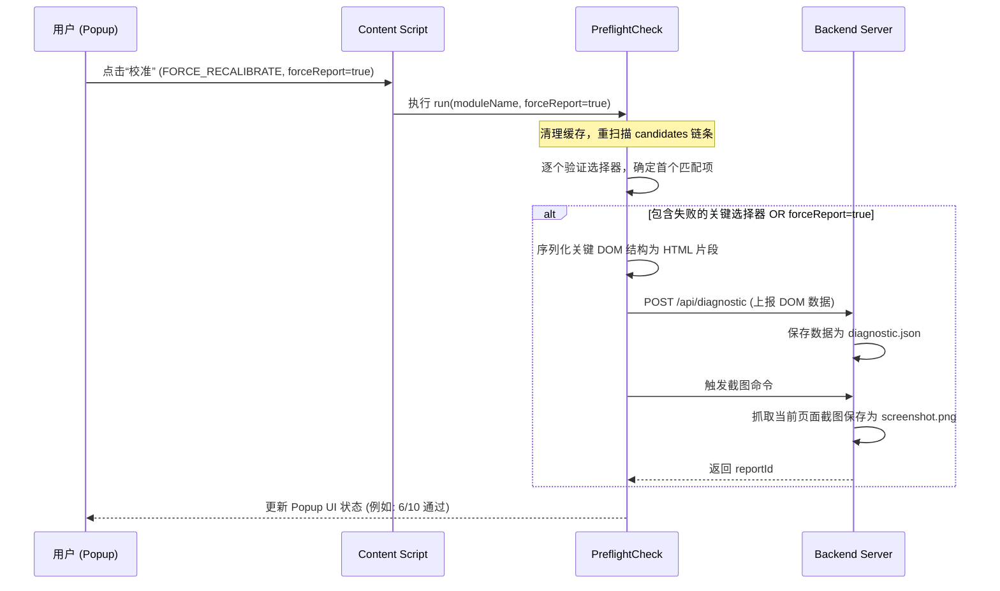

# 📡 DOM 智能校准与诊断系统设计文档

在针对复杂的第三方网页（如 Boss 直聘）进行自动化与辅助时，前端界面的频繁改版、A/B 测试和动态渲染常常是导致插件失效的“致命伤”。

为了解决这一痛点，本项目设计并实现了一套**具备自愈能力（Self-Healing）的双阶段 DOM 校准与诊断数据上报系统**。

---

## 🏗️ 核心架构组件

系统的设计主要由以下四个模块协同运作：

```
┌────────────────────────┐
│  Selector Registry     │ <── 集中维护选择器候选优先级链条
└───────────┬────────────┘
            │
            ▼
┌────────────────────────┐
│  Preflight Check (Web) │ <── 执行匹配校验，更新 resolved 内存及 Cache
└───────────┬────────────┘
            │
      ┌─────┴──────────────┐
      ▼ (校准失败 / 强制)     ▼ (校准成功)
┌───────────┐        ┌───────────┐
│诊断数据上报│        │ 写入 Cache│ <── 写入 chrome.storage (24h TTL)
└─────┬─────┘        └───────────┘
      │
      ▼
┌───────────┐
│后端服务器  │ <── 接收报告、截取图片、生成 diagnostics/ 归档目录
└───────────┘
```

### 1. 集中式选择器注册表 (`SelectorRegistry`)
所有 Content Script 的 DOM 查询不直接写死 Selector 字符串，而是统一注册在 `selector-registry.js` 中。
* **优先级候选链条 (`candidates`)**：每个 DOM 元素对应一个候选数组，按“最精准 -> 较模糊 -> 降级兜底”的顺序排列。
* **校验器规则 (`verify`)**：定义了验证规则，如 `minCount` (最少元素数量) 或 `textContains` (包含特定文字)。
* **关键性定义 (`critical`)**：指示该元素是否是业务运行必须的。如果非关键项校准失败，只警告不阻塞，最大化保证系统可用性。

### 2. 预飞校准引擎 (`PreflightCheck`)
在 `preflight-check.js` 中实现。
* **按序校验**：对每个选择器，从前到后尝试 `candidates` 链条，直到遇到第一个满足 `verify` 校验的 CSS 选择器，并记录为 `resolved` 映射。
* **缓存与 TTL 控制**：校准结果会缓存到 `chrome.storage.local` 中，有效期 24 小时。在有效期内启动时，直接从缓存读取（耗时 <5ms）。

### 3. 双阶段校准（SPA 优化）
Boss 直聘聊天控制台是一个单页面应用（SPA），聊天列表和聊天对话框处于不同的生命周期中：
* **第一阶段：聊天列表校准 (`chatObserver` 模块)**
  * **触发时机**：进入 `/web/chat/index` 页面时立即运行。
  * **校验范围**：仅校准左侧候选人列表、未读徽章、活跃项等始终存在于主页的元素。
  * **效果**：无论是否点开候选人，页面初始化校准均能百分百绿灯通过。
* **第二阶段：聊天对话框校准 (`chatConversation` 模块)**
  * **触发时机**：在页面初始化（如果已经点开对话），或者当用户/扫雷程序**切换候选人会话**时，延迟 500ms 动态自动执行。
  * **校验范围**：校准消息容器、文本气泡、姓名、输入框、发送按钮、简历卡片。
  * **效果**：实现按需动态校准，极大地提高了对动态渲染 DOM 的适应性。

---

## 🛠️ 诊断与自愈管线 (Diagnostic Pipeline)

当校准未达到完美状态时，系统会启动诊断流：

### 1. 自动上报（关键项失败时）
如果校准结果中，任何一个被标为 `critical: true`（关键）的选择器在链条中全部尝试失败，系统判定发生严重故障，将自动调用 `collectAndReport()`：
* **DOM 树切片**：抓取关键 DOM 节点（如左侧列表和右侧聊天对话框）的 `outerHTML` 代码。
* **状态收集**：收集当前的 URL、页面标题、Iframe 结构、匹配 of 类名集和详细的失败信息。
* **截图生成**：向后端发起请求，调用后端服务器截取当前网页的可视区图像。

### 2. 强制手动上报（排查与调优时）
当用户手动在插件弹窗中点击 **“校准”** 按钮时：
* 插件会向网页端发送带有 `forceReport: true` 标志的指令。
* 校准引擎不管最终是全绿通过还是部分通过，**一律强行生成当前的 DOM 结构快照和屏幕截图，并上报给后端**。
* **作用**：帮助开发和维护人员在不报错的情况下，获取实际页面布局，进行精准的 Selector 调优与校验排查。

### 3. 后端归档存储
后端服务器在接收到 `/api/diagnostic` 请求后：
1. 自动在本地创建 `backend/data/diagnostics/模块名_年月日_时分秒/` 归档文件夹。
2. 将收集 of DOM 及校验数据存为 `diagnostic.json`。
3. 将网页可视区图像存为 `screenshot.png`。

---

## 📊 状态流图 (Sequence Diagram)

下面是手动触发双阶段校准时的调用时序图：


